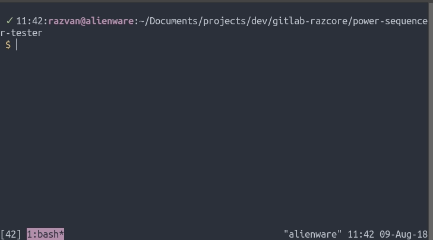

Blender Power Sequencer Renderer
================================

This is a `standalone python
package <https://pypi.org/project/bpsrender/>`__ as well as a module
which is used under the hood in the `Blender Power Sequencer
add-on <https://github.com/GDquest/Blender-power-sequencer>`__ to speed
up rendering `VSE
projects <https://docs.blender.org/manual/en/dev/editors/vse/index.html>`__
by spawning Blender processes in background in parallel.

Install
-------

It can be installed as a standalone command line utility `via
PiPy <https://pypi.org/project/bpsrender/>`__:
``pip install [--user] bpsrender``. *Note* that you have to have
``$HOME/.local/bin`` included in your ``$PATH`` environment variable (on
unix) if you're going to install the utility locally (using ``--user``
when executing ``pip``).

Usage
-----

After installing the script, get help by writing ``bpsrender -h``:

::

    usage: bpsrender [-h] [-w WORKERS] [-v] [--dry-run] [-m] [-c] [-d] [-j]
                     blendfile

    Multi-process Blender VSE rendering - will attempt to create a folder called
    `render` inside of the folder containing `blendfile`. Insider `render` another
    folder called `parts` will be created for storing temporary files. These files
    will be joined together as the last step to produce the final render which
    will be stored inside `render` and it will have the same name as `blendfile`

    positional arguments:
      blendfile             Blender project file to render.

    optional arguments:
      -h, --help            show this help message and exit
      -w WORKERS, --workers WORKERS
                            Number of workers in the pool (for video rendering).
      -v, --verbose         Increase verbosity level (eg. -vvv).
      --dry-run             Run the script without actual rendering or creating
                            files and folders. For DEBUGGING purposes
      -m, --mixdown-only    ONLY render the audio MIXDOWN
      -c, --concatenate-only
                            ONLY CONCATENATE the (already) available video chunks
      -d, --video-only      ONLY render the VIDEO (implies --concatenate-only).
      -j, --join-only       ONLY JOIN the mixdown with the video. This will
                            produce the final render

Known Issues
------------

-  [ ] CTRL-C interrupt leaves subprocesses running in the background
-  [ ] CTRL-C interrupt doesn't clean the folders yet
